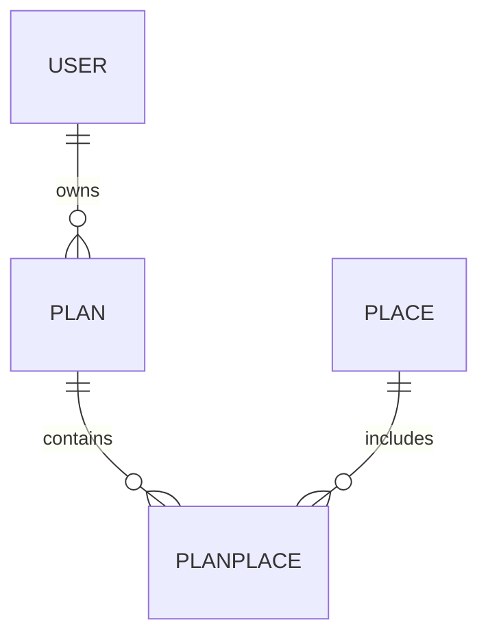
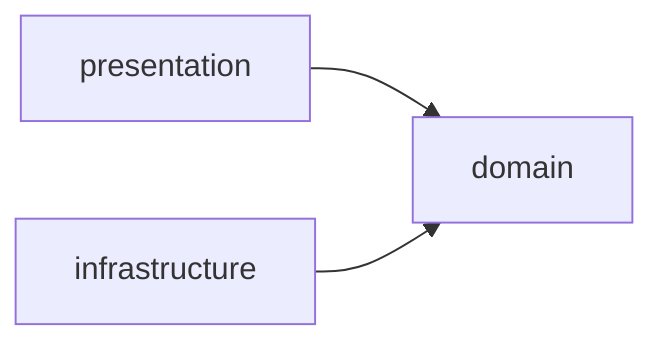

# PlanIt MVP — Architecture & Design

> Platform for discovering and sharing experiences/plans in Buenos Aires.

## Quick Path

1. User registers/logs in → session created
2. Explores places on interactive map (Leaflet + OSM)
3. Creates a plan, adds places with dates/times
4. Shares plan via unique URL
5. Anyone can view shared plan (no login required)

## 1. Domain Model

### Entities



| Entity | Fields | Notes |
|--------|--------|-------|
| **User** | id, email, password, role, active | Already exists |
| **Place** | id, name, description, category, address, imageUrl, latitude, longitude | Seed data for BA |
| **Plan** | id, name, description, date, visibility (PUBLIC/PRIVATE), userId | Owner relationship |
| **PlanPlace** | id, planId, placeId, visitDate, visitTime, order | Junction + scheduling |

### Categories (Place)

`RESTAURANT`, `BAR`, `CAFE`, `MUSEUM`, `PARK`, `SHOPPING`, `NIGHTLIFE`, `CULTURE`, `SPORT`, `OTHER`

### Visibility (Plan)

- `PRIVATE` — only owner can see
- `PUBLIC` — accessible via shared URL without login

## 2. Architecture Layers

```
com.valhalla
├── domain/
│   ├── user/           (User, UserService, UserRepository)
│   ├── login/          (LoginService)
│   ├── place/          (Place, PlaceService, PlaceRepository)
│   ├── plan/           (Plan, PlanService, PlanRepository)
│   ├── planplace/      (PlanPlace, PlanPlaceService, PlanPlaceRepository)
│   └── exception/      (DomainException hierarchy)
├── infrastructure/
│   ├── user/           (UserRepositoryImpl, JpaUserRepository)
│   ├── place/          (PlaceRepositoryImpl, JpaPlaceRepository)
│   ├── plan/           (PlanRepositoryImpl, JpaPlanRepository)
│   ├── planplace/      (PlanPlaceRepositoryImpl, JpaPlanPlaceRepository)
│   └── security/       (CustomUserDetailsService)
├── presentation/
│   ├── login/          (LoginController)
│   ├── user/           (UserController, EditUserRequest)
│   ├── place/          (PlaceController, PlaceRestController)
│   ├── plan/           (PlanController, PlanPlaceRestController)
│   ├── share/          (ShareController)
│   └── shared/         (GlobalExceptionHandler)
├── config/             (JpaConfig, SecurityConfig, BaseWebConfig)
└── MyServletInitializer
```

### Dependency Rule



- Domain layer has NO dependencies on Spring, JPA, or Thymeleaf
- Infrastructure implements domain interfaces (Repository pattern)
- Presentation uses domain services, never infrastructure directly

## 3. Controllers & Routes

### Authenticated Routes (Spring Security required)

| Method | Route | Controller | View |
|--------|-------|------------|------|
| GET | `/` | LoginController | redirect → /login |
| GET | `/login` | LoginController | pages/auth/login |
| GET | `/new-user` | LoginController | pages/auth/new-user |
| POST | `/register` | LoginController | redirect → /login |
| GET | `/home` | LoginController | pages/home |
| GET | `/places` | PlaceController | pages/places/list |
| GET | `/places/{id}` | PlaceController | pages/places/detail |
| GET | `/plans` | PlanController | pages/plans/list |
| GET | `/plans/new` | PlanController | pages/plans/new |
| POST | `/plans` | PlanController | redirect → /plans/{id} |
| GET | `/plans/{id}` | PlanController | pages/plans/detail |
| PUT | `/plans/{id}` | PlanController | redirect → /plans/{id} |
| DELETE | `/plans/{id}` | PlanController | redirect → /plans |
| POST | `/plans/{id}/share` | PlanController | JSON { url } |
| POST | `/plans/{id}/visibility` | PlanController | JSON { visibility } |

**Spring Security handles:**
- `POST /validate-login` → authenticates user, redirects to /home
- `POST /logout` → invalidates session, redirects to /login

### REST API Routes (CSRF exempt)

| Method | Route | Controller |
|--------|-------|------------|
| GET | `/api/places` | PlaceRestController |
| GET | `/api/plans/{planId}/places` | PlanPlaceRestController |
| POST | `/api/plans/{planId}/places` | PlanPlaceRestController |
| PUT | `/api/plans/{planId}/places/{id}` | PlanPlaceRestController |
| DELETE | `/api/plans/{planId}/places/{id}` | PlanPlaceRestController |
| POST | `/api/plans/{planId}/places/reorder` | PlanPlaceRestController |

### Public Routes (no login)

| Method | Route | Controller | View |
|--------|-------|------------|------|
| GET | `/share/{shortCode}` | ShareController | pages/share/view |

## 4. Database Schema

### users (existing)

```sql
CREATE TABLE users (
    id BIGSERIAL PRIMARY KEY,
    email VARCHAR(255) UNIQUE NOT NULL,
    password VARCHAR(255) NOT NULL,
    role VARCHAR(50) DEFAULT 'USER',
    active BOOLEAN DEFAULT FALSE
);
```

### places (new)

```sql
CREATE TABLE places (
    id BIGSERIAL PRIMARY KEY,
    name VARCHAR(255) NOT NULL,
    description TEXT,
    category VARCHAR(50) NOT NULL,
    address VARCHAR(500),
    image_url VARCHAR(500),
    latitude DOUBLE PRECISION,
    longitude DOUBLE PRECISION
);

CREATE INDEX idx_places_category ON places(category);
CREATE INDEX idx_places_location ON places(latitude, longitude);
```

### plans (new)

```sql
CREATE TABLE plans (
    id BIGSERIAL PRIMARY KEY,
    name VARCHAR(255) NOT NULL,
    description TEXT,
    visit_date DATE,
    visibility VARCHAR(20) DEFAULT 'PRIVATE',
    short_code VARCHAR(10) UNIQUE,
    user_id BIGINT NOT NULL REFERENCES users(id),
    created_at TIMESTAMP DEFAULT CURRENT_TIMESTAMP
);

CREATE INDEX idx_plans_user ON plans(user_id);
CREATE INDEX idx_plans_short_code ON plans(short_code);
```

### plan_places (new)

```sql
CREATE TABLE plan_places (
    id BIGSERIAL PRIMARY KEY,
    plan_id BIGINT NOT NULL REFERENCES plans(id) ON DELETE CASCADE,
    place_id BIGINT NOT NULL REFERENCES places(id),
    visit_date DATE,
    visit_time TIME,
    sort_order INT DEFAULT 0,
    UNIQUE(plan_id, place_id)
);

CREATE INDEX idx_plan_places_plan ON plan_places(plan_id);
```

## 5. Frontend Architecture

### Template Structure

```
src/main/webapp/WEB-INF/templates/
├── pages/
│   ├── auth/
│   │   ├── login.html
│   │   └── new-user.html
│   ├── home.html
│   ├── places/
│   │   ├── list.html          (map + sidebar)
│   │   └── detail.html        (detail + embedded map)
│   ├── plans/
│   │   ├── list.html
│   │   ├── new.html           (form)
│   │   └── detail.html        (itinerary + map)
│   └── share/
│       └── view.html          (public view + map)
├── fragments/
│   └── header.html
└── layout.html                (base layout)
```

### Static Resources

```
src/main/webapp/resources/
├── css/
│   └── app.css
├── js/
│   ├── app.js                 (main bundle)
│   ├── map.js                 (Leaflet initialization)
│   ├── places.js              (place markers, filters)
│   ├── plan-builder.js        (plan creation with map)
│   └── share-view.js          (public plan map)
└── lib/
    ├── leaflet/               (Leaflet CSS + JS)
    └── leaflet-markercluster/ (marker clustering)
```

### Map Integration (Leaflet + OSM)

| Feature | Implementation |
|---------|----------------|
| Base map | OpenStreetMap tiles (free, no API key) |
| Markers | Custom markers by category (color/icon) |
| Popups | Place name, category, link to detail |
| Clustering | Leaflet.markercluster for dense areas |
| Responsive | Fullscreen on mobile, sidebar on desktop |
| Filters | Category filter toggles marker visibility |
| Route lines | Leaflet.Polyline between plan places |

## 6. User Flows

### Flow 1: Explore Places

```
1. User clicks "Explorar" → GET /places
2. Map loads centered on Buenos Aires (-34.6037, -58.3816)
3. All places shown as markers on map
4. Sidebar shows place cards (synced with map)
5. User filters by category → markers update
6. User clicks marker → popup with info + "Ver detalle"
7. User clicks "Ver detalle" → GET /places/{id}
```

### Flow 2: Create Plan

```
1. User clicks "Crear plan" → GET /plans/new
2. Form: name, description, date, visibility
3. Map preview shows Buenos Aires
4. User submits → POST /plans → redirect /plans/{id}
5. Plan detail page shows empty itinerary
6. User clicks "Agregar lugares" → redirect /places
7. User clicks place → "Agregar al plan" button
8. POST /plans/{id}/places → redirect /plans/{id}
9. Itinerary updates with new place
```

### Flow 3: Build Itinerary

```
1. User in plan detail → GET /plans/{id}
2. Map shows selected places as numbered markers
3. Line connects places in order
4. Sidebar shows itinerary list
5. User drags to reorder → PUT /plans/{id}/places/reorder
6. User sets date/time per place → inline edit
7. User removes place → DELETE /plans/{id}/places/{planPlaceId}
```

### Flow 4: Share Plan

```
1. User clicks "Compartir" → POST /plans/{id}/share
2. Backend generates shortCode, saves to plan
3. Returns shareable URL: /share/{shortCode}
4. User copies link → feedback "Copiado!"
5. Recipient opens link → GET /share/{shortCode}
6. Public page loads: plan info + itinerary + map
7. No login required, read-only view
```

### Flow 5: View Shared Plan (Public)

```
1. Anonymous user opens /share/{shortCode}
2. ShareController resolves plan by shortCode
3. If plan not found → error page "Plan no encontrado"
4. If plan is PRIVATE → error page "Este plan es privado"
5. If plan is PUBLIC → render share/view.html
6. Map shows all places with markers + route lines
7. Sidebar shows itinerary with dates/times
```

## 7. Key Decisions

| Decision | Choice | Rationale |
|----------|--------|-----------|
| Map library | Leaflet + OpenStreetMap | Free, no API key, open source |
| Share mechanism | Short code in URL | Simple, no token exposure |
| Template engine | Thymeleaf | Already in stack, server-side rendering |
| Session auth | Spring Security | Declarative route protection, CSRF, login/logout |
| DB for places | PostgreSQL (prod) | Already configured, supports PostGIS if needed later |
| Seed data | CommandLineRunner | Simple for MVP, migrate to Flyway later |
| Frontend | Tailwind CSS + Vue.js (CDN) | No build step, fast development |

## 8. Implementation Order

| Phase | Cards | Dependencies |
|-------|-------|--------------|
| 1. Auth & Users | [LOG] | None |
| 2. Places + Map | [PLC], [FIC] | Phase 1 |
| 3. Plans | [PLN] | Phase 1 |
| 4. Itinerary | [APL] | Phase 2, 3 |
| 5. Share | [CMP], [VPC] | Phase 3 |

## Checklist

- [ ] Domain model validated with team
- [ ] DB schema reviewed
- [ ] Routes approved
- [ ] Map integration approach confirmed
- [ ] Template structure agreed
- [ ] Implementation order confirmed

## Next Step

Review this doc with the team, then start implementation with [LOG] card.
