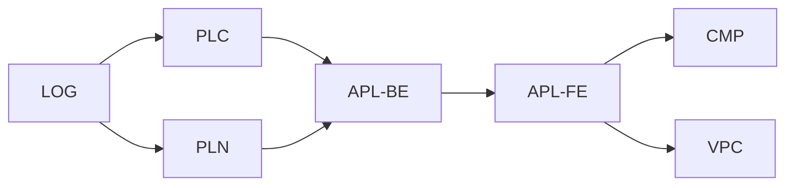

# Sprint Planner : PlanIt

> 6 personas · 3 equipos de 2 · 5 sprints

```mermaid
gantt
    title Sprint Plan - PlanIt
    dateFormat X
    axisFormat Sprint %s

    section Equipo A
    Sprint 1 LOG (base)        :done,    s1a, 0, 1
    Sprint 2 PLC (lugares)     :active,  s2a, 1, 2
    Sprint 3 APL-BE (backend)  :         s3a, 2, 3
    Sprint 4 APL-FE (frontend) :         s4a, 3, 4
    Sprint 5 CMP (compartir)   :         s5a, 4, 5

    section Equipo B
    Sprint 1 LOG (soporte)      :done,    s1b, 0, 1
    Sprint 2 PLN (planes)      :active,  s2b, 1, 2
    Sprint 3 Tests PLC         :         s3b, 2, 3
    Sprint 4 Tests APL-BE      :         s4b, 3, 4
    Sprint 5 VPC (vista publica) :        s5b, 4, 5

    section Equipo C
    Sprint 1 LOG (soporte)      :done,    s1c, 0, 1
    Sprint 2 Tests LOG         :active,  s2c, 1, 2
    Sprint 3 Tests PLN         :         s3c, 2, 3
    Sprint 4 Tests APL-BE      :         s4c, 3, 4
    Sprint 5 Tests E2E         :         s5c, 4, 5
```

## Dependencias

## Sprint 1 : Base

**Objetivo:** Spring Security funcional, login/logout/register andando.

| Equipo | Card | Specs | Tareas |
|--------|------|-------|--------|
| A | **[LOG]** | 01-LOG.md | Ver spec (11 impl + 13 tests) |
| B | **[LOG]** | 01-LOG.md | Ayuda a A o prepara infra de testing |
| C | **[LOG]** | 01-LOG.md | Ayuda a A o prepara infra de testing |

**Salida esperada:**
- `mvn jetty:run` levanta, login/logout/register funcionan
- Header muestra email del usuario logueado
- Validación de formulario andando

**Notas:**
- El trabajo de LOG ya está casi listo en local (pom.xml, BaseJpaConfig, .env.example actualizados)
- Los equipos B y C pueden aprovechar para entender la arquitectura y preparar el entorno de test
- Cada spec incluye Acceptance Criteria, Test Scenarios (unit/integration/security/E2E) e Implementation Reference. Ver `docs/spec-format.md`

---

## Sprint 2 : Lugares + Planes (paralelo)

**Objetivo:** Places con mapa + CRUD de Plans funcional.

| Equipo | Card | Specs | Tareas |
|--------|------|-------|--------|
| A | **[PLC]** | 02-PLC.md | Ver spec (impl + tests incluidos) |
| B | **[PLN]** | 03-PLN.md | Ver spec (impl + tests incluidos) |
| C | Tests de [LOG] | 01-LOG.md | Ver checklist Tests en card Trello |

**Salida esperada:**
- Mapa de BA con markers, filtros, sidebar sincronizada
- Ficha de lugar con imagen, mapa, descripción
- CRUD de planes (crear, listar, detalle, eliminar)
- Tests de LOG pasando

**Dependencias:** [LOG] completado en Sprint 1.

---

## Sprint 3 : Backend de Itinerario

**Objetivo:** Agregar lugares a planes vía REST, reordenar itinerario.

| Equipo | Card | Specs | Tareas |
|--------|------|-------|--------|
| A | **[APL-BE]** | 04-APL-BE.md | Ver spec (impl + tests incluidos) |
| B | Tests de [PLC] | 02-PLC.md | Ver checklist Tests en card Trello |
| C | Tests de [PLN] | 03-PLN.md | Ver checklist Tests en card Trello |

**Salida esperada:**
- Entity PlanPlace + repositorios + service + REST endpoints
- PlaceController muestra planes del usuario en la ficha
- Tests de PLC y PLN pasando

**Dependencias:** [PLC] + [PLN] completados en Sprint 2.

---

## Sprint 4 : Frontend de Itinerario

**Objetivo:** Botón "Add to plan" + itinerario visual con mapa y rutas.

| Equipo | Card | Specs | Tareas |
|--------|------|-------|--------|
| A | **[APL-FE]** | 05-APL-FE.md | Ver spec (impl + tests incluidos) |
| B | Tests de [APL-BE] | 04-APL-BE.md | Ver checklist Tests en card Trello |
| C | Tests de [APL-BE] | 04-APL-BE.md | Integration tests + fix de bugs |

**Salida esperada:**
- Botón "Add to plan" en ficha de lugar funcional
- Itinerario con markers numerados + ruta en mapa
- Editar fecha/hora por place, eliminar places del plan
- Tests de APL-BE pasando

**Dependencias:** [APL-BE] completado en Sprint 3.

---

## Sprint 5 : Compartir + Vista Pública

**Objetivo:** Compartir planes vía link + vista pública sin login.

| Equipo | Card | Specs | Tareas |
|--------|------|-------|--------|
| A | **[CMP]** | 06-CMP.md | Ver spec (impl + tests incluidos) |
| B | **[VPC]** | 07-VPC.md | Ver spec (impl + tests incluidos) |
| C | Tests E2E + integración | 01-LOG.md a 07-VPC.md | Tests end-to-end con Playwright |

**Salida esperada:**
- Botón "Share" genera link único
- Toggle de visibilidad público/privado
- Vista pública sin login: itinerario + mapa
- Plan privado muestra error en vista pública
- Tests E2E pasando

**Dependencias:** [APL-FE] completado en Sprint 4. CMP y VPC son paralelizables.

---

## Resumen de Carga

| Sprint | Cards | Equipos |
|--------|-------|---------|
| 1 | [LOG] | 1 activo + 2 soporte |
| 2 | [PLC] + [PLN] + tests LOG | 2 activos + 1 testing |
| 3 | [APL-BE] + tests PLC/PLN | 1 activo + 2 testing |
| 4 | [APL-FE] + tests APL-BE | 1 activo + 2 testing |
| 5 | [CMP] + [VPC] + E2E | 2 activos + 1 E2E |

> Cada spec incluye sus propios tests. Las cards de Trello tienen dos checklists: "Implementacion" y "Tests".
