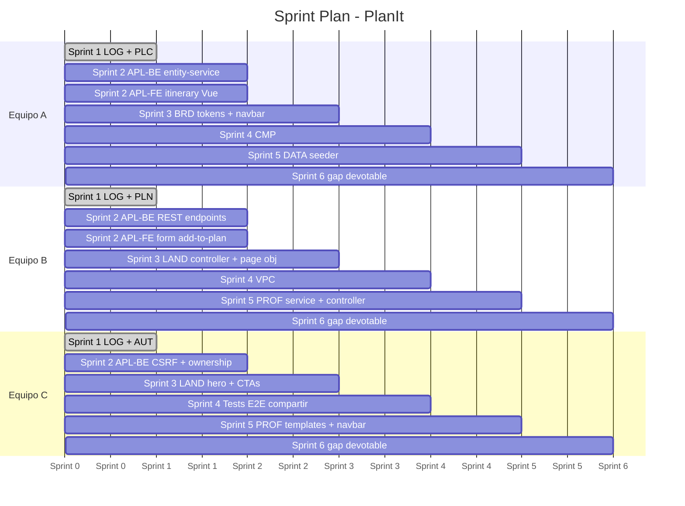

# Sprint Planner : PlanIt

> 6 personas · 3 equipos de 2 · 6 sprints · **15 pts de capacidad por sprint**

Este documento es la fuente del plan de sprints. El detalle card por card con
puntos y tareas está en las secciones de sprint, más abajo.

**Criterio de ordenamiento: cada sprint entrega una feature completa y demostrable.** Un sprint
que cierra con un backend al que le falta la interfaz no sirve. Por eso APL-BE y APL-FE van
juntas en Sprint 2 aunque no quepan en 15 pts.

## Dónde estamos

**Sprint 1 está terminado.** Duró 2 semanas y entregó 29 pts: LOG + PLC + PLN + AUT.

| Sprint | Review | Estado | Entrega | Pts |
|---|---|---|---|---|
| 1 | 1 oct 2026 | **Terminado** (2 semanas) | Base + Lugares + Planes + Auth | 29 |
| 2 | 8 oct 2026 | **Arranca hoy** | Itinerario completo | 18 |
| 3 | 15 oct 2026 | Pendiente | Branding + Landing | 6 |
| 4 | 5 nov 2026 | Pendiente | Compartir completo | 8 |
| 5 | 12 nov 2026 | Pendiente | Contenido + Perfil | 8 |
| 6 | 19 nov 2026 | Pendiente | **gap** — pulido y demo | 0 |

**Sprint 2 arranca hoy y ya está comprometido:** APL-BE + APL-FE, 18 pts, due date 9 oct. Los 5
sprints que quedan (2 a 6) tienen su alcance definido; Sprint 6 es el único vacío, a propósito.

### Sobre "CLOSED" en Trello

Las 4 cards de Sprint 1 están en CLOSED porque su código mergeó, no porque el sprint cerrara.
**CLOSED no significa "sprint entregado"**: el trabajo de esas 4 cards ocurrió en septiembre, entre
el 8 y el 28, y se movieron a CLOSED todas el 2 de octubre, el mismo día.

## Calendario del curso

Las fechas son fijas. **Sprint 1 duró 2 semanas; los 5 restantes duran 1 cada uno.**

| Fecha | Qué | Sprint |
|---|---|---|
| 3 sep | Validación de idea con los equipos | — |
| 10 sep | Docker: intro, war, imagen, compose | — |
| 17 sep | Repaso: funcionalidad punta a punta | — |
| 24 sep | Pruebas punta a punta | — |
| **1 oct** | **REVIEW SPRINT 1** | 1 · **terminado** — 2 semanas, 29 pts |
| **8 oct** | **REVIEW SPRINT 2** | 2 · 2→8 oct — **6 días** |
| **15 oct** | **REVIEW SPRINT 3** | 3 · 8→15 oct |
| 22 oct | *Integración de herramientas / servicios externos* | **no es sprint** |
| 29 oct | *Uso avanzado de editores* | **no es sprint** |
| **5 nov** | **REVIEW SPRINT 4** | 4 · 29 oct→5 nov |
| **12 nov** | **REVIEW SPRINT 5** | 5 · 5→12 nov |
| **19 nov** | **REVIEW SPRINT 6** | 6 · 12→19 nov |

Entre la review de Sprint 3 (15 oct) y la de Sprint 4 (5 nov) hay 3 semanas sin review. Dos son
las semanas de coursework; la tercera es el colchón más grande del calendario.

**Trello no tiene dimensión de sprint.** Las 4 cards de Sprint 1 están en CLOSED porque su código
mergeó, no porque el sprint cerrara. No hay label de sprint ni custom field: los 9 labels siguen
solo con color y los custom fields vacíos. Desde el 2 de octubre las **8 cards de trabajo**
(APL-BE, APL-FE, CMP, VPC, BRD, LAND, DATA, PROF) llevan la fecha de review de su sprint como due
date; las 4 cards cerradas (LOG, PLC, PLN, AUT) siguen sin fecha.

## Gantt


```mermaid
gantt
    title Sprint Plan - PlanIt
    dateFormat X
    axisFormat Sprint %s

    section Equipo A
    Sprint 1 LOG + PLC                  :done, s1a, 0, 1
    Sprint 2 APL-BE entity-service      :     s2a, 1, 2
    Sprint 2 APL-FE itinerary Vue        :     s2a2, 1, 2
    Sprint 3 BRD tokens + navbar         :     s3a, 2, 3
    Sprint 4 CMP                        :     s4a, 3, 4
    Sprint 5 DATA seeder                :     s5a, 4, 5
    Sprint 6 gap devotable              :     s6a, 5, 6

    section Equipo B
    Sprint 1 LOG + PLN                  :done, s1b, 0, 1
    Sprint 2 APL-BE REST endpoints      :     s2b, 1, 2
    Sprint 2 APL-FE form add-to-plan    :     s2b2, 1, 2
    Sprint 3 LAND controller + page obj :     s3b, 2, 3
    Sprint 4 VPC                        :     s4b, 3, 4
    Sprint 5 PROF service + controller  :     s5b, 4, 5
    Sprint 6 gap devotable              :     s6b, 5, 6

    section Equipo C
    Sprint 1 LOG + AUT                  :done, s1c, 0, 1
    Sprint 2 APL-BE CSRF + ownership    :     s2c, 1, 2
    Sprint 3 LAND hero + CTAs           :     s3c, 2, 3
    Sprint 4 Tests E2E compartir         :     s4c, 3, 4
    Sprint 5 PROF templates + navbar    :     s5c, 4, 5
    Sprint 6 gap devotable              :     s6c, 5, 6
```

En el gantt, `:done` marca Sprint 1, que cerró con su review del 1 de octubre. Los dos tracks
numerados 2 (Sprint 2) del mismo equipo son **secuenciales, no paralelos**: APL-FE arranca cuando
la capa REST cierra.

## Dependencias

Restricciones verificadas contra los archivos. No se pueden romper al reordenar sprints:

| Cards | Conflicto | Cómo lo resuelve el plan |
| :--- | :--- | :--- |
| APL-BE · APL-FE | APL-FE necesita que los endpoints existan | Secuenciales **dentro** de Sprint 2, en vez de sprints distintos |
| BRD · LAND · PROF | Las tres tocan `components/navbar.html` | Secuenciales: BRD → LAND en Sprint 3, PROF sola en Sprint 5 |
| DATA · BRD | El assert de `PlacesViewE2E` ata el hex `#e74c3c` al DOM | DATA en Sprint 5, BRD en Sprint 3. Margen de 4 semanas |
| PROF · APL-BE | Las dos tocan `config/SecurityConfig.java` | Nunca en el mismo sprint: APL-BE en 2, PROF en 5 |
| CMP · VPC | **Ya no se pisan**: CMP toca `plans/detail.html`, VPC crea su propio controller y template | En paralelo en Sprint 4 |

El solapamiento original entre CMP y VPC estaba en el archivo de test, no en producción; se
resolvió al corregir las specs.

```
LOG, PLC, PLN, AUT  ──>  Sprint 2: APL-BE ──> APL-FE  ──┐
                                │                        ├──> Sprint 4: CMP + VPC
                          Sprint 3: BRD ──> LAND ──┬───> Sprint 5: DATA + PROF
                                                   │
                                              (navbar: secuencial)
```

---

## Sprint 1 : Base + Lugares + Planes + Auth

**Review: 1 de octubre 2026. TERMINADO.** Duró 2 semanas y entregó 29 pts = 14,5 pts/semana.

| Equipo | Card | Specs | Pts | Tareas |
|--------|------|-------|-----|--------|
| A + B + C | **[LOG]** | 01-LOG.md | 13 | Login/logout, admin UI bajo `/admin`, harness E2E. Mergeado (PRs #1 y #3) |
| A | **[PLC]** | 02-PLC.md | 5 | Mapa Leaflet, ficha migrada al panel lateral. Mergeado (PR #6) |
| B | **[PLN]** | 03-PLN.md | 8 | Planes con `shortCode` y `isPublic`. Mergeado (PR #2) |
| C | **[AUT]** | 08-AUT.md | 3 | Registro, login, recuperación de contraseña. Mergeado (PR #5) |

El PR #4 (CL) quedó CLOSED sin mergear, superseded por el PR #6. El PR #7 endureció el harness E2E.

---

## Sprint 2 : Itinerario completo

**Review: 8 de octubre 2026. Arranca el 2 de octubre — 6 días.** 18 pts · **120%**

**Objetivo:** agrego un lugar a un plan desde `/places` y el plan lo muestra ordenado, con marcadores
numerados y la ruta en el mapa. La feature entera, no la mitad.

| Card | Pts | Specs | Tareas |
|---|---|---|---|
| **[APL-BE]** | 13 | `04-APL-BE.md` | 1 Create PlanPlace entity · 2 Repository · 3 Service · 4 JPA Repository · 5 RepositoryImpl · 6 REST endpoints · 7 Update PlaceController · 8 Narrow the CSRF ignore list · 9 Ownership (404, no 403) · 10 `ResetDatabase` |
| **[APL-FE]** | 5 | `05-APL-FE.md` | 1 Form "Add to plan" en el panel lateral de `/places` · 2 Itinerario con Vue.js en el detail del plan |

Las 6 primeras tareas de APL-BE construyen; las 4 últimas **cierran agujeros que están abiertos
hoy** — por eso vale 13 pts y no 5.

| Equipo | Track | Pts | Specs |
|--------|-------|-----|-------|
| A | APL-BE: entity → repository → service → JPA → impl (tareas 1–5) | 5 | 04-APL-BE.md |
| B | APL-BE: REST endpoints (tarea 6) + tests de la capa | 4 | 04-APL-BE.md |
| C | APL-BE: PlaceController, CSRF, ownership, `ResetDatabase` (tareas 7–10) | 4 | 04-APL-BE.md |
| A | APL-FE: itinerario Vue en el detail — arranca cuando B cierra la tarea 6 | 3 | 05-APL-FE.md |
| B | APL-FE: form "Add to plan" en el panel — arranca cuando B cierra la tarea 6 | 2 | 05-APL-FE.md |

**Salida esperada:**
- `PlanPlace` + repositorios + service + endpoints REST de escritura con sesión
- El panel lateral de `/places` incluye los planes del usuario y el form para agregar
- El detail del plan muestra el itinerario con marcadores numerados y la ruta en el mapa
- Editar fecha/hora por place, eliminar places del plan
- `csrf.ignoringRequestMatchers("/api/**")` deja de cubrir las escrituras de itinerarios
- Ownership: 404 y no 403 si el plan no es del usuario
- `ResetDatabase` borra `plan_place` antes que `plans`, o la suite E2E entera muere
- `domain/*` y `presentation/*` al 100% de cobertura, o el gate de JaCoCo falla

**Dependencias:** PLC + PLN de Sprint 1. APL-FE depende de APL-BE *dentro* del mismo sprint, así que
los tracks de APL-FE no arrancan hasta que la tarea 6 aterriza (~día 3).

> **El punto más apretado del plan:** 18 pts en 6 días, no 7, con dependencia interna. Las 6
> primeras tareas de APL-BE son el camino crítico y no se recortan. Lo que se acorta, si hace
> falta, es alcance de APL-FE — un itinerario sin endpoints no existe.
>
> Mitigación: las specs son inusualmente concretas. APL-BE tiene 13 criterios de aceptación y 10
> secciones de implementación con firmas reales de método; APL-FE tiene 11 criterios y 2 secciones.
> No hay decisiones de diseño pendientes durante el sprint.

---

## Sprint 3 : Branding + Landing

**Review: 15 de octubre 2026.** 6 pts · 40%

**Objetivo:** el sitio deja de decir `UNLAM` y tiene una landing navegable con hero, propuesta de
valor y CTAs por rol.

| Card | Pts | Specs | Tareas |
|---|---|---|---|
| **[BRD]** → **[LAND]** | 3 → 3 | `09-BRD.md`, `10-LAND.md` | 1 Tokens de diseño en `base.html` · 2 Nombre y logo en `navbar.html` · 3 `<title>` de auth · 4 Favicon ·→· 5 `LandingController`: exponer el rol · 6 `landing.html`: hero, valor, CTAs · 7 Page object del E2E |

| Equipo | Track | Pts | Specs |
|--------|-------|-----|-------|
| A | BRD: tokens de diseño en `base.html`, nombre y logo en `navbar.html`, favicon | 3 | 09-BRD.md |
| B | BRD: `<title>` de las páginas de auth · LAND: `LandingController` + page object del E2E | 3 | 09-BRD.md, 10-LAND.md |
| C | LAND: `landing.html` con hero, valor y CTAs | 3 | 10-LAND.md |

**Salida esperada:**
- Tokens aplicados a navbar, landing, auth, places y plans. El navbar deja de decir `UNLAM`
- Hero, value prop y CTAs por rol en la landing, responsive
- Hoy el único CTA apunta a `{/admin}`, que no existe: es un 404 real
- Page object del E2E de la landing

**Dependencias:** BRD → LAND, **secuencial dentro del sprint**: las dos tocan
`components/navbar.html`. Con 6 pts y 40% de ocupación hay margen, pero el paralelismo real es
cero: el Equipo C espera a que el Equipo A cierre el navbar.

Las semanas del 22 y 29 de octubre son coursework, así que este sprint tiene 3 semanas de colchón
antes de Sprint 4.

---

## Sprint 4 : Compartir + Vista pública

**Review: 5 de noviembre 2026.** 8 pts · 53%

**Objetivo:** comparto un plan por link y cualquiera lo abre sin login. **Es el sprint del núcleo
del producto.**

| Card | Pts | Specs | Tareas |
|---|---|---|---|
| **[CMP]** | 3 | `06-CMP.md` | 1 Verify `Plan.shortCode` · 2 `PlanController`: share endpoint · 3 Template: share modal |
| **[VPC]** | 5 | `07-VPC.md` | 1 `ShareController` · 2 Share view template · 3 `SecurityConfig`: verificar, no cambiar |

| Equipo | Track | Pts | Specs |
|--------|-------|-----|-------|
| A | CMP | 3 | 06-CMP.md |
| B | VPC | 5 | 07-VPC.md |
| C | Tests E2E de compartir y vista pública | — | 06-CMP.md, 07-VPC.md |

**Salida esperada:**
- Botón "Share" genera link único
- Toggle de visibilidad público/privado (`Boolean isPublic`)
- Vista pública sin login: itinerario + mapa. Plan privado muestra error

**Dependencias:** APL-FE (Sprint 2) cerrado antes. **CMP y VPC ya no se pisan** — el solapamiento
original estaba en un archivo de test y se resolvió al corregir las specs. Llega una semana antes del
review final, con margen para pulir.

---

## Sprint 5 : Contenido + Perfil

**Review: 12 de noviembre 2026.** 8 pts · 53%

**Objetivo:** los lugares tienen contenido real en vez del placeholder, y el usuario puede cambiar
su nombre y su contraseña sin pasar por el admin.

| Card | Pts | Specs | Tareas |
|---|---|---|---|
| **[DATA]** | 3 | `12-DATA.md` | 1 Ampliar el dataset en `PlaceDataSeeder` · 2 Recalibrar `PlacesViewE2E` · 3 `ResetDatabase`: decidir si `places` entra en el reset |
| **[PROF]** | 5 | `11-PROF.md` | 1 Métodos de dominio en `User` · 2 `UserService`: profile y password · 3 `ProfileController` · 4 Templates y navbar |

| Equipo | Track | Pts | Specs |
|--------|-------|-----|-------|
| A | DATA | 3 | 12-DATA.md |
| B | PROF: métodos de dominio en `User`, `UserService`, `ProfileController` | 3 | 11-PROF.md |
| C | PROF: templates de `/profile` y link en el navbar | 2 | 11-PROF.md |

**Salida esperada:**
- Más de los 10 lugares seedeados, con imágenes reales. Hoy los 10 comparten
  `place-placeholder.svg`
- `PlacesViewE2E` recalibrado contra el dataset nuevo
- Editar el nombre propio desde `/profile`
- Cambiar la contraseña sin pasar por el admin
- Link al perfil en el navbar

**Dependencias:** DATA corre 4 semanas después de BRD, así que el assert del hex `#e74c3c` de
`PlacesViewE2E` no se rompe. PROF toca `components/navbar.html` (no puede ir en paralelo con BRD ni
LAND) y `config/SecurityConfig.java` (no puede ir en el mismo sprint que APL-BE). Ninguna de las
dos restricciones choca con Sprint 5.

---

## Sprint 6 : Pulido y demo

**Review: 19 de noviembre 2026. Última review del curso.** 0 pts comprometidas

**Objetivo:** cerrar lo que se corrió, ajustar lo que quedó feo y preparar la demostración final.

Sin cards comprometidas y sin equipos asignados. Los 10 pts de holgura de este sprint son el seguro
del plan: si Sprint 2 desbordó, el trabajo entra acá.

---

## Resumen de Carga

Capacidad = **15 pts por sprint** (1 semana, 3 equipos de 2). Sprint 1 entregó 29 pts en 2 semanas
= 14,5 pts/semana, redondeado hacia abajo.

**Terminado:**

| Sprint | Compromiso | Pts |
|---|---|---|
| 1 — **terminado, 2 semanas** | [LOG] + [PLC] + [PLN] + [AUT] | 29 |

**Por comprometer:**

| Sprint | Review | Entrega | Compromiso | Pts | Ocupación | Holgura |
|---|---|---|---|---|---|---|
| 2 | 8 oct | Itinerario completo | [APL-BE] → [APL-FE] | 18 | **120%** | −3 |
| 3 | 15 oct | Branding + landing | [BRD] → [LAND] | 6 | 40% | 9 |
| 4 | 5 nov | Compartir completo | [CMP] + [VPC] en paralelo | 8 | 53% | 7 |
| 5 | 12 nov | Contenido + perfil | [DATA] + [PROF] en paralelo | 8 | 53% | 7 |
| 6 | 19 nov | Pulido y demo | gap devotable | 0 | 0% | 15 |
| | | | **Total** | **40** | **53% de 75** | **35** |

**5 sprints × 15 = 75 pts de capacidad contra 40 pts comprometidos (53%).** Entra todo el alcance,
incluido [PROF].

**El promedio esconde el perfil real.** Sprint 2 está en 120% y Sprint 6 en 0%. Los cuatro sprints
intermedios están en 40–53%, así que el desborde de Sprint 2 lo absorben sin rearrastre. Ese fue el
criterio para decidir: dejar Sprint 2 sobrecargado a cambio de que la review del 8 de octubre muestre
la feature terminada.

> **Caveat.** El 15 es **una sola medición**. Sprint 1, además de las 4 cards, absorbió `4a52611`
> (PR #7, endurecer el harness E2E, 6 de 13 hallazgos del audit) y 4 commits de fix. Si ese
> hardening fue inversión única, 15 pts/semana es limpio. Si fue scope recurrente, Sprint 1 entregó
> *más* de 15 y el plan tiene más margen del que parece.

> Cada spec incluye sus propios tests, y las cards de Trello los tienen: las 12 del board llevan las
> dos checklists "Implementacion" y "Tests", 144 ítems. Las cards APL-BE, APL-FE, CMP y VPC están
> hoy en BACKLOG con descripción, User Story, puntos y due date de review; lo único que les falta
> son **responsables**.

## Riesgos abiertos

| Riesgo | Impacto |
|---|---|
| **Sprint 2 está en 120% y tiene 6 días** | Es el sprint más apretado del plan. Si APL-FE no entra, la review del 8 oct muestra endpoints sin interfaz — el mismo problema que queríamos evitar. Lo que se acorta es alcance de APL-FE, nunca el backend |
| Velocity de 15 pts es de **una sola medición** | Sprint 1 fue el único sprint medido. Si el equipo rinde menos con cards nuevas, el plan se resiente en Sprint 2 primero |
| Sprint 3 encadena BRD → LAND | Ambas tocan el navbar y no se pueden paralelizar. Con 6 pts y 40% de ocupación hay margen, pero no es paralelismo real |
| `PlacesViewE2E` tiene un assert **vacuo** | Verifica que el popup tenga 0 links, pero la línea siguiente verifica que no exista el popup. El 0 del primer assert no prueba nada |
| `ResetDatabase` no borra `places` | El seeder nuevo de DATA no llegaría a la base de E2E |
| 4 ramas remotas obsoletas sin borrar | `task-01_LOG-tests` (7209 líneas de diff) y `task-02_PLN` (1688). Un `git merge` borraría PLC, AUT y `gate.ps1` |

## Qué falta antes de arrancar Sprint 2

Las cards APL-BE, APL-FE, CMP y VPC están en BACKLOG. Lo único que les falta es lo que no se puede
escribir desde el board: **2 responsables cada una**. Todo lo demás ya está — descripción con User
Story y dependencias, bloque de puntos, due date de review, y las dos checklists `Implementacion` +
`Tests`, sembradas antes del 2 de octubre. Las 4 cards nuevas (BRD, LAND, DATA, PROF) también
existen, con las mismas dos checklists.

Plantilla de cada card: objetivo · pre-requisitos · link a la spec · **puntos** · dependencias ·
riesgo conocido. Y dos checklists, "Implementacion" y "Tests", que ya existen en las 12 cards del
board: es el formato heredado, no uno que haya que inventar.

Dos problemas de higiene del board, ya resueltos:

- **El board no tenía dimensión de sprint.** Sin label, custom field ni due date no se podía saber en
  qué sprint está una card; ahora cada una de las 8 cards lleva la **fecha de review de su sprint**
  como due date. Los custom fields y los labels con nombre siguen vacíos.
- **"Registro e inicio de sesion" vs "[AUT] Auth de Usuarios".** Si era la misma card duplicada,
  quedó resuelto: `Registro e inicio de sesion` y `[FIC] Ficha de lugar` ya están archivadas. No hay
  duplicado activo.

Pendiente de reconciliar en Trello (escritura remota, esperando OK explícito):

- 1 movimiento: solo APL-BE → READY FOR DEV
- 4 responsables: 2 en APL-BE, 2 en APL-FE
- 2 comentarios: PLC con el rediseño D1, VPC con `T-LOG-012`
- 8 checklists duplicados: borrado manual desde la UI — el conector MCP no expone borrado de
  checklists ni de ítems
- 0 borrados de cards

**Ya ejecutado el 2 de octubre:** 4 cards nuevas (BRD 3, LAND 3, PROF 5, DATA 3) · bloque de puntos
y due date en las 8 cards, 40 pts · dependencias corregidas en APL-FE y VPC · **8 checklists
sembradas solo en las 4 cards nuevas**, porque las otras 8 ya las tenían.
